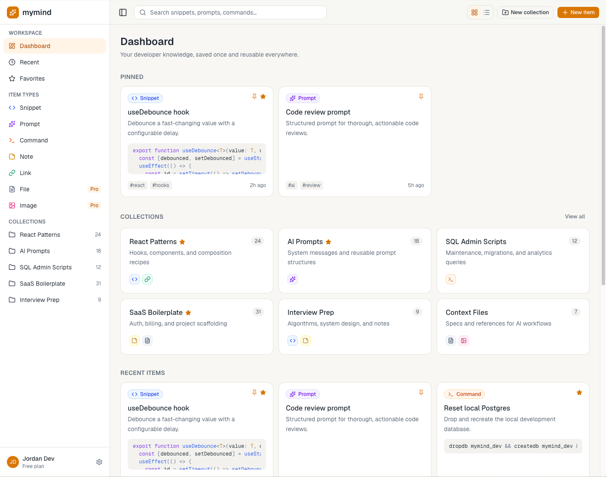
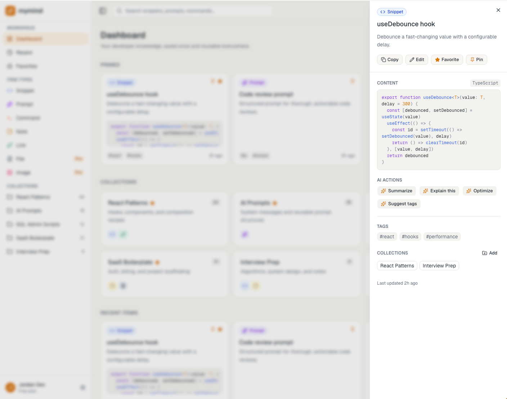

# mymind

**mymind** is a centralized hub that gathers scattered resources into one developer-focused hub where users can save, organize, search, and reuse their most valuable technical knowledge.

It stores the following: 
- Code snippets
- AI prompts
- Terminal commands
- Notes and explanations
- Useful links
- Project context files
- Screenshots and diagrams 

I want it to be similar to Raycast, but with the organization of Notion. 

## my goals with this project
Current ver. is going to be a web app, but the long-term vision is to build a more integrated developer workflow. 

Eventually, I want mymind to have: 
- keyboard shortcuts for search (i.e ⌘ + space to search), think Raycast and Spotlight
- quick access while you're in other windows so that you can quickly dump and retrieve info
- be super speedy 
- team workflows, easily share collections (similar to Postman)

## UI Screenshots




## Tech Stack
- Next.js 
- React 
- TypeScript
- Tailwind CSS
- PostgreSQL
- Prisma

## AI features
Planned features: 
- When creating an item, it will suggest tags 
- "Explain this code" 
- Can find similaar items to clean up your collections (i.e when trying to add a new item, will inform user that there is a v similar item already existing)
- Generated summaries -- users can click a button to generate a summary of the item, this can maybe help with search, as users would not have to remmeber the specific item title, just be able to describe what they're looking for generally 

I want AI in this app to be used v. intentionally, only where it really counts, and it should always be possible for user to disable features. 

## Getting Started

Run the development server:

```bash
npm run dev
# or
yarn dev
# or
pnpm dev
# or
bun dev
```

Open [http://localhost:3000](http://localhost:3000) with your browser to see the result.